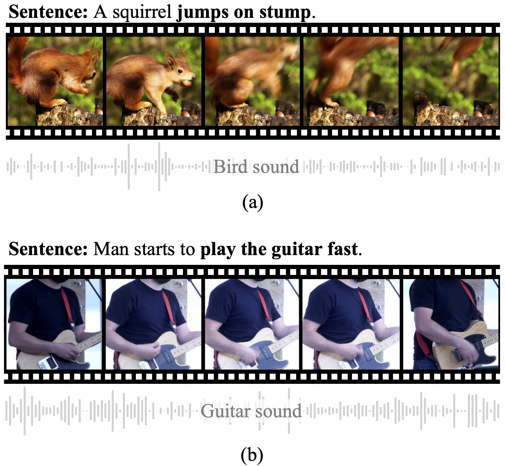

# Video-aided Unsupervised Grammar Induction

We investigate video-aided grammar induction, which learns a constituency parser from both unlabeled text and its corresponding video.
We explore rich features (e.g. action, object, scene, audio, face, OCR and speech) from videos, taking the recent Compound PCFG as the baseline. 
We further propose a Multi-Modal Compound PCFG model (MMC-PCFG) to effectively aggregate these rich features from different modalities.




## Prerequisites
- pytorch 1.5.0
- python 3.7
- easydict
- terminaltables
- tqdm
- numpy
- (Modified) [Torch-Struct](https://github.com/zhaoyanpeng/pytorch-struct)
- (Optional) [benepar](https://github.com/nikitakit/self-attentive-parser)


## Quick Start

Please download the data from [google drive](https://drive.google.com/drive/folders/1198D9xpDd52QSOCSwM3HP7ki1L75aMV5?usp=sharing) and save it to the `data` folder.
Preprocessing details are described [here](#preprocessing-details).

### Training
Run the following commands for training:
```
sh scripts/didemo/train.sh 
sh scripts/youcook2/train.sh 
sh scripts/msrvtt/train.sh 
```
For VC-PCFG and MMC-PCFG, each run will take approximate 2 hours on DiDeMo, 1 hour on YouCook2 and 10 hours on MSRVTT with a single GTX 1080Ti or GTX 2080Ti.


### Testing
Our trained model are provided in [google drive](https://drive.google.com/drive/folders/1EZ0xh2K49e9jEVK8-A-W0Fzvb0DdV1dW?usp=sharing). Please download them to the `final_checkpoints` folder.

Then, run the following commands for evaluation:
```
sh scripts/didemo/test.sh 
sh scripts/youcook2/test.sh 
sh scripts/msrvtt/test.sh 
```

## Preprocessing Details
Download the data from [CVPR 2020: Video Pentathlon challenge](https://www.robots.ox.ac.uk/~vgg/challenges/video-pentathlon/challenge.html) and save it to the `data` folder.
After that, preprocess sentences with the following scripts:
```
python tools/preprocess_captions.py
python tools/compute_gold_trees.py
python tools/generate_vocabularies.py
```  


## Acknowledgements
This repo is developed based on [vpcfg](https://github.com/zhaoyanpeng/vpcfg) and [detr](https://github.com/facebookresearch/detr).

## Citation
If any part of our paper and code is helpful to your work, please generously cite with:
```
@InProceedings{zhang2021video,
author = {Zhang, Songyang and Song, Linfeng and Jin, Lifeng and Xu, Kun and Yu, Dong and Luo, Jiebo},
title = {Video-aided Unsupervised Grammar Induction},
booktitle = {NAACL},
year = {2021}
} 
```
